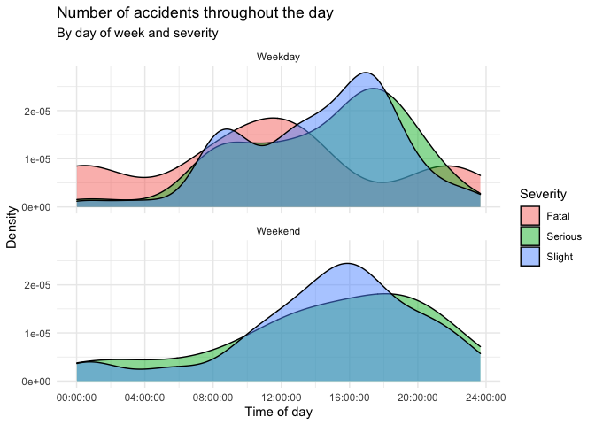

HW 03 - Road traffic accidents
================
Jieming Xiao
07/14/2022

## Load packages and data

``` r
library(tidyverse)
library(dsbox)
```

## Exercises

### Exercise 1

There are 768 rows in the dataset.

### Exercise 2

Each row represents a case of road traffic accident.

### Exercise 3

For weekends, most accidents happen during afternoon with the peak
around 4pm. For weekdays, a lot of accidents happen during rushing hours
around 8am and 4pm.

``` r
accidents_recode <-accidents %>%
  mutate(week = recode(day_of_week,
                       `Monday` = "Weekday",
                       `Tuesday` = "Weekday",
                       `Wednesday` = "Weekday",
                       `Thursday` = "Weekday",
                       `Friday` = "Weekday",
                       `Saturday` = "Weekend",
                       `Sunday` = "Weekend"))
ggplot(accidents_recode, aes(x = time, 
                  fill = severity)) +
  geom_density(adjust = 1, 
               alpha = 0.5
               ) +
    theme_minimal()+
 facet_wrap(~week,
            nrow =2) +
  labs(
    x = "Time of day",
    y = "Density",
    title = "Number of accidents throughout the day", 
    subtitle = "By day of week and severity",
    fill = "Severity",
  )
```

<!-- -->

### Exercise 4
